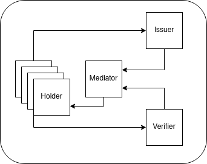

   
  

<h1 align="center"><b>Aries Akrida</b></h1>

  <a href="#features">Features</a> &nbsp;|&nbsp;
  <a href="#design">Design</a> &nbsp;|&nbsp;
  <a href="#getting-started">Getting started</a> &nbsp;|&nbsp;
  <a href="#contributing">Contributing</a> &nbsp;|&nbsp;
  <a href="#license">License</a> 

The Aries Akrida is designed to **load test** various [Hyperledger Aries](https://www.hyperledger.org/projects/aries) **deployments**.

The project uses the [Locust](https://locust.io/) tool in combination with [Aries Framwork Javascript](https://github.com/hyperledger/aries-framework-javascript) to test [DIDComm](https://decentralized-id.com/projects/decentralized-identity-foundation/did-communications/) based protocols. 

From Ancient Greek ἀκρίς, or akrída, means locust or grasshopper.

## Features

- 🦗 Easy to run load tests distributed over multiple machines using [Locust](https://locust.io/) with the ability to swarm from thousands to hundreds of thousands of simultaneous users.
- 🐍 Easy to write Python tests
- 📦️ Isolated users using greenlet and Node.js environment
- 📃 Provides a user friendly web interface that shows the progress of your test in real-time. It can also be run without the UI, making it easy to use for CI/CD testing.

## Design 

Typically, three to four types of agents may be involved in a decentralized identity environment. There is typically a large number of holder agents, a mediator agent for the holder agents, and one or more issuer and verifier agents.

Example of a typical environment with a mediator:

Aries Akrida is designed to take place of the holder agents. This allows Aries Akrida to provide a load on the Mediator, Issuer, and/or Verifier agents.

Example of Locust with a mediator:

See [design](./docs/DESIGN.md) for more design details.

## Getting Started

Before starting any load testing you **SHOULD** gain written permission that includes the time, method and various systems that you wish to load test. You **MUST NOT** load test any system that you do **NOT** have permission to test.

To get started quickly on your local machine, you can try out the [Quick Start Guide](./docs/QUICKSTART.md)

For high concurrency testing, it is useful to run Locust on a VM where you can easily add more resources for bigger tests. Please read [docs/VM.md](./docs/VM.md)

### Demo

TODO - Video Demo

### Getting Started

For spinning up the non-clustered portion of the environment, please see our [instructional document](./docs/NONCLUSTERED.md).

## Contributing

If you would like to contribute to the framework, please read the [Framework Developers README](/DEVREADME.md) and the [CONTRIBUTING](/CONTRIBUTING.md) guidelines. These documents will provide more information to get you started!

## License

Hyperledger Akrida is licensed under the [Apache License Version 2.0 (Apache-2.0)](/LICENSE).
