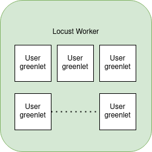

# Aries Akrida Design

- Use proven load scale platform ( Locust )
- Support scaling with the use of clustering ( Locust )
- Provide easy to use interface with metrics ( Locust )
- Ensure each user scales independently ( Independent Aries Framework Javascript Subprocesses )
- Simulate real world clients ( Aries Framework Javascript )

## Why Locust

While there are some over-arching goals when picking a load testing framework, such as

- Clustering / Scaling
- Simplicity
- Community
- Open Source License
- Extendable

We also want the framework to be easy to develop against, and something the community is familiar with. This means that the programming languages for the testing framework are going to be either Python or Javascript. 

After reviewing Locust, JMeter, Taurus, nGrinder, The Grinder, k6, Tsung, and Siege, we found that Locust had the simplest interface to bring up and manage, was very capable, and was easily extendable. This is not saying the other frameworks aren't capable frameworks, but we found that for us, Locust was the best choice.

## Subprocess Design

Each user in Locust is represented by a gevent greenlet. This greenlet runs all of the tasks for each user. After completing the tasks, the greenlet will repeat all the tasks after some type of wait interval.

As we can see below, each greenlet represents a different User.



Greenlets works well when an individual user doesn't use too much CPU. In our case, we are doing some high CPU tasks, such as encryption and decryption of messages.

In this case, we have each gevent greenlet create a subprocess to handle the CPU intensive tasks. Commands are sent over stdin, and responses are received over stdout.


The commands are sent as JSON, and responses are received as JSON.

Example of a successful start command being sent and response:

```
stdin -> {"cmd": "start","withMediation": true,"port":"5555"}
stdout <- {"error":0,"result":"Initialized agent..."}
```

Example of a unsuccessful start command being sent and response:

```
stdin -> {"cmd": "start","withMediation": true,"port":"5555"}
stdout <- {"error":1,"result":{}} 
```

The design of the agent.js is such that a single stdin request is made, and a single stdout response is received. This simple pattern is used for all of the commands issued to agent.js.

This allows for manual testing of the interactions between Locust and agent.js. This pattern would also allow a new agent using Python or Rust to be defined as long as it followed the same input / output pattern.

### commmand: start 

cmd: start

description: Runs the initialization of the Aries Framework Javascript agent, including any connections to mediators. The startup command must be run before any other commands.

parameters: withMediation, port

withMediation: withMediation accepts a boolean value. With mediation indicates that Aries Framework Javascript should use the mediator defined in the .env file.

port: if withMediation is false, a port must be defined for agent.js to use for incoming DIDComm messages. The port must be mapped in docker-compose and the firewall so external services can access the port. The .env file specifies a starting and ending port. If more processes are started than ports are mapped, it can cause the Locust process to hang. If a large number of ports are mapped, it can cause a significant delay in docker-compose starting up.

Examples: 

Successful command

```
stdin -> {"cmd": "start","withMediation": true,"port":"5555"}
stdout <- {"error":0,"result":"Initialized agent..."}
```

Unsuccessful command

```
stdin -> {"cmd": "start","withMediation": true,"port":"5555"}
stdout <- {"error":1,"result":{}} 
```

### command: shutdown 

cmd: shutdown

description: Cleanly shuts down the Aries Framework Javascript agent and terminates the agent.js process. If the shutdown command is unsuccessful within the defined timeout, Locust will kill the subprocess.

parameters: None

Examples: 

Successful command

```
stdin -> {"cmd": "start","withMediation": true,"port":"5555"}
stdout <- {"error":0,"result":"Initialized agent..."}
stdin -> {"cmd":"shutdown"}
stdout <- {"error":0,"result":"Shutting down agent"}
```

### command: ping_mediator 

cmd: ping_mediator

description: The Ping Mediator command sends a trust ping to the mediator agent with response_requested. The mediator agent will then respond with ping-response over the mediation connection. This is used to verify agents are connected to the mediator. This is useful to test that an agent is still connected to the mediator. This function is used when testing the number of agents that can be connected to the mediator at the same time. If the Ping Mediator command doesn't respond within the specified timeout in the .env, an error will be received.

parameters: None

Examples:

Successful command

```
stdin -> {"cmd": "start","withMediation": true,"port":"5555"}
stdout <- {"error":0,"result":"Initialized agent..."}
stdin -> {"cmd":"ping_mediator"}
stdout <- {"error":0,"result":"Ping Mediator"}
```

Unsuccessful command

```
stdin -> {"cmd": "start","withMediation": true,"port":"5555"}
stdout <- {"error":1,"result":{}} 
stdin -> {"cmd":"ping_mediator"}
stdout <- {"error":1,"result":"Mediator timeout!"}
```

### command: receiveInvitation

cmd: 

description: 

parameters: None

Examples:

Successful command

```
stdin -> {"cmd": "start","withMediation": true,"port":"5555"}
stdout <- {"error":0,"result":"Initialized agent..."}
stdin -> {"cmd":"ping_mediator"}
stdout <- {"error":0,"result":"Ping Mediator"}
```

Unsuccessful command

```
stdin -> {"cmd": "start","withMediation": true,"port":"5555"}
stdout <- {"error":1,"result":{}} 
stdin -> {"cmd":"ping_mediator"}
stdout <- {"error":1,"result":"Mediator timeout!"}
```

- Handling timeouts
- Error handling

## Configuration Design


## Why Aries Javascript Framework

## Why not use Clustered Aries Framework Javascript or Aca-Py Users ?

